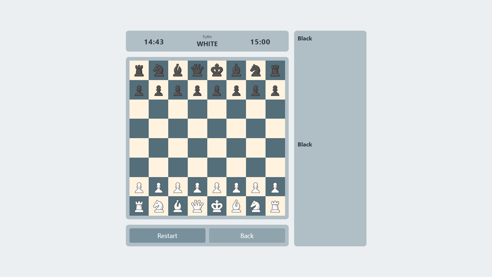
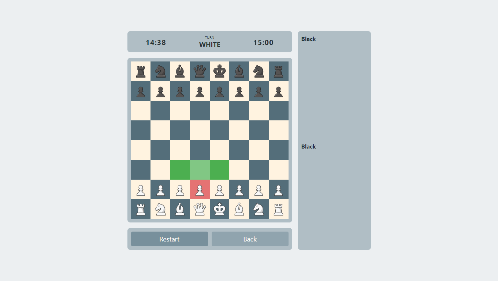
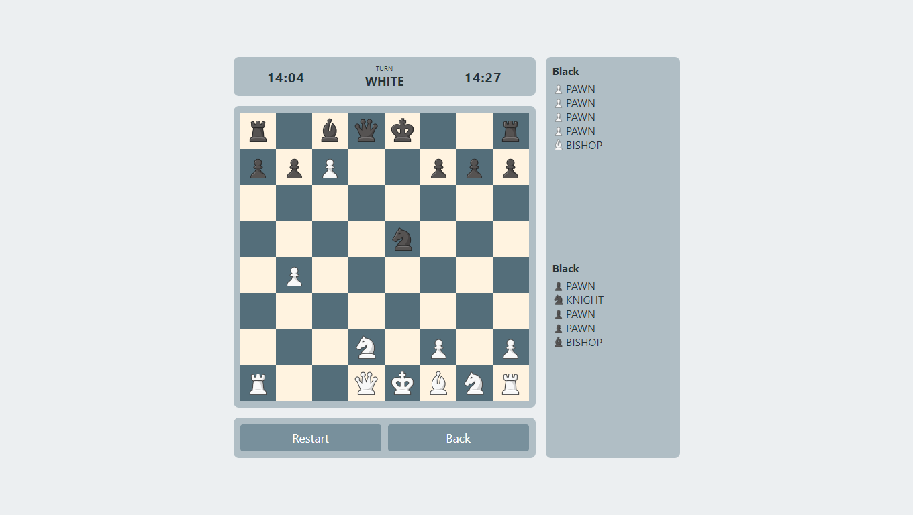

# React Chess App

This is a chess application built using React.

# Screenshots

   

# Installation and Usage

* Clone the repository.
* Navigate to the project directory.
* Run npm install to install dependencies.
* Run npm run dev to start the development server.
* Open http://localhost:3000 in your web browser.

# License

This project is licensed under the MIT License. See the [LICENSE](./LICENSE.md) file for details.
